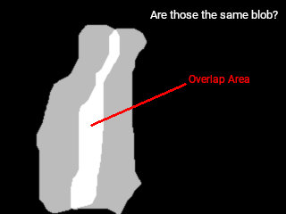

# **DANIELE DOMENICHELLI - UNIBO** 
## **COMPUTER VISION AND IMAGE PROCESSING - PROJECT:**
## *Development of a computer vision system aimed at intrusion detection*

## Index:
1. [Introduction](#1-introduction)
2. [Video Analysis](#2-video-analysis)
    1. [Background Initialization](#21-background-initialization)
    2. [Background Subtraction](#22-background-subtraction)
    3. [Image Preprocessing and Blob Detection](#23-image-preprocessing-and-blob-detection)
    4. [Blob Analysis](#24-blob-analysis)
    5. [Blob Classification](#25-blob-classification)
    6. [Background Update](#26-background-update)
3. [Software Requirements](#3-software-requirements)
4. [Software Usage](#4-software-usage)
5. [Visual Editor](#5-visual-editor)
    1. [Windows](#51-windows)
    2. [Visual Informations](#52-visual-informations)
    3. [Key Bindings](#53-key-bindings)
6. [Technical Details](#6-technical-details)
    1. [Pipeline](#61-pipeline)
    2. [File Pipeline](#62-file-pipeline)
    3. [Real Time Computation](#63-real-time-computation)
7. [Conclusions](#7-conclusions)

## 1 Introduction:

The software system is aimed to analyze a video and detect objects that do not belong to a static reference scene. The system can distinguish them as `person`, `true object` and `false object`.

- `Person:` always moving object
- `Object:` any kind of object that is not classified as a `person`
    - `True Object:` a new object appeared in the scene
    - `False Object:` an object removed from the scene

Input _(rasterized and compressed gif)_ | Output _(rasterized and compressed gif)_
-|-
 | 

[Back to Index](#index)

## 2 Video Analysis

The video analysis is led by two principal steps:

- Offline elaboration _(pre-elaboration based on the video)_:
    - Retriving video informations (fps, channels, etc.)
    - `Pipelines` initialization
    - Background initialization
- Online elaboration _(real time elaboration based on `pipelines`)_:
    - Background subtraction
    - Image pre-processing and contours extraction
    - Image binarization and blob detection
    - Blob analysis
    - Blob mask and output
    - Background update

[Back to Index](#index)

### 2.1 Background Initialization

There are two kinds of techniques usefull for the background extraction from a video: blind and selective initialization. Different statistical methods are then used to retrive an extimation of the background, they can be mean, median or mode.

After many attemps, I observed these remarkable points in different methods:

method | ambient type | noise resistance | light changes | motion resistance | Image
-|-|-|-|-|-
mean | effective in static ambients | very good | good in slight changes | good only with very fast movements | 
mode | good in dynamic ambients | bad | bad in continuous changes | good if motions are not too much slow, otherwise really bad | 
median | effective in static ambients | good | very relisient to moderate changes | good if motions are not too much slow | 
max | completely static or very exposed ambients | ambient dependent | very relisient to global sudden changes | absent (very ambient dependent) | 
min | completely static ambients  | ambient dependent | very low _(maybe good just in case of light emitting objects?)_ | absent (very ambient dependent) | 

Even if apparently useless, Min and Max methods can be useful for isolate background from foreground pixels (maybe in a further analysis step).

Since the background update is performed at every frame, a selective initialization would not lead a so much better performance. Indeed, in order to mantain a good startup time, I decided to use a blind technique.

Comparing results of different methods, I tried to minimize the loss points of each method by mixing them up. I ended up with a really simple custom blind technique to initialize the background, using mean and median, the most promising blind methods:

`background = 0.5 * mean + 0.5 * median`

The mode brings to the background a bunch of noisy black pixels, expecially where the man standing for a while, on the right corner of the office. So it was excluded from the initialization.

With this initialization, the number of frame can be dropped (for the given video) to likely 60 frames, but for stability I set to 100 the default intial range.

[Back to Index](#index)

### 2.2 Background Subtraction

After being initialized, in order to detect changes, it is possible to compute the pixel wise difference of a frame with the background.

During the first stages of development, I was stacked to eliminate light changes from the difference. Some special cases were those where the man reflects the light of the lamp on the wall behind the desk, and when he leaves the camera.

Looking at the background image and inspired by the DoG detector, I had a good intuition about the background:
>It is not so important that the background and the image have the same intensity at each pixel, but at least the pixel should be similar in the same region. That is most likely a sort of local features of a little region of the background.

As we can see, the image sharpness is lightly loss while performing the background initialization, this because of the mean and median methods. So, in order to enhance the comparison between background and current frame, it is possible to blur and then compare them.

_Left: real input; Right: blurred initialized background_

After trying different filters (Gaussian first, then mean and bilateral), I have found that the best solution to skim some light changes and noise is to apply a bilateral filter to both images, before the subtraction:

`new_frame = abs(bilateral(background) - bilateral(current_frame))`

The good results can are even highlighted by applying a threshold to erase regions of little changes:

Background | Input | Subtraction | Bilateral Filter Subtraction
-|-|-|-
 |  |  | 

[Back to Index](#index)

### 2.3 Image Preprocessing and Blob Detection

Once found the differences, I just apply a series of morphological operators to isolate shapes of the blobs. The chain is this:

1. Black-padding image - add a black border outside the image, prevents some operations to wrongly melt with image edges
2. Threshold - erase low changes
3. Area opening - erase contours leading shaped with little areas, which are not interesting
4. Elliptical kernel closing - closes holes in founded shapes and unites detached contours
5. Vertical kernel closing - closes vertical holes generated by figures leaving the camera
6. Elliptical kernel opening - tries to restore the original shape lost after closing
7. Cut image - restoring initial image size, removing the black padding
8. Image binarization - set every pixel different from black equal to white, to mark the pixel as "blob" or "not blob" (white = blob presence, black = blob absence)

The vertical kernel was usefull to prevent a shape to separate while very near to an image edge:

Counturs Filling | Elliptical Closing | Vertical Closing
-|-|-
 |  | 

All of these are the steps found in the `change detection pipeline`

[Back to Index](#index)

### 2.4 Blob Analysis

At last, after found the blobs in the image, it is possible to extract some interesting features based on their shape and position. The formulas used to retrive them are the following:

property | formula | property | formula
-|-|-|-
spatial moments | `m[i,j] = sum[x,y](contour[x,y] * x^i * y^j)` | mass center | `Cx = m[1,0] / m[0,0]; Cy = m[0,1] / m[0,0]`
central moments | `mu[i,j] = sum[x,y](contour[x,y] * (x-Cx)^i * (y - Cy)^j)` | normalized central moments | `nu[i,j] = mu[i,j] / (m[0,0] ^ (1+i/2+j/2)`
contour | scan for 8-connected pixels | perimeter | conunt of pixel in the contour 
area | count of pixel internal the countour shape | convex hull | Sklansky’s algorithm _(incorrect but fast)_
bounding rect | `(minX, minY, maxX, maxY)` of contours | rect area | `rectWidth * rectHeight`
aspect | `width / height` | extent | `area / rectArea`
solidity | `area / hullArea` | diameter | `sqrt(4 * area / π)`
major axis | solves the generalized eigensystem | minor axis | solves the generalized eigensystem

Now you could can perform the analysis at each frame and extract different blobs but the computer has no idea which blob corresponds to any of the next frame blobs. In order to achieve the frame wise correspondence we have to introduce a similarity function:

**blob1 is similar blob2 if** all of these conditions are true:
- **blob1 minimal rect** overlaps **blob2 minimal rect**
- the **overlap area** of minimal rect is greater or equal than a threshold
- the **perimeter** absolute difference is lesser or equal than a threshold
- the **aspect** absolute difference is lesser or equal than a threshold
- the **extent** absolute difference is lesser or equal than a threshold
- the **solodity** absolute difference is lesser or equal than a threshold
- the **diameter** absolute difference is lesser or equal than a threshold

The minimal rect is defined as the bounding rect enlarged of a certain amount of pixel (rect distance). In combination with the overlapping area, brings to define a kind of speed threshold for the blob: if the blob moves too much, the bounding rects in the frame sequence can detach (and not more overlap); enlarging the two rects by a small ammount of pixel can resolve problem for blobs that moving fast in the video. Anyway the overlap area reduce the probability to confuse two nearby blobs as the same.

The others thresholded parameters are important to understand if a blob is likely the same of the previous frame: if it changed its shape too much between the frames, maybe it is not the same blob, but just two dofferent fast moving objects. To prevent false blob recognition, shape parameters are indispensable.

To speed up all the matching process between frames, the blobs of the previous one are sorted by their area. A big blob in the current frame has an high probability to be big even in the next one, so sorting them, it will have a better chance to check their similarity as soon as possible. Once a blob match we can stop checking other blobs similarities.

[Back to Index](#index)

### 2.5 Blob Classification

The next step is to classify each blob as `person`, `true object` or `false object`. Following the given definition a `person` is a blob that always moves in each frame. To simply achieve this labeling we can measure the frame wise pixel distance, called center speed of the blob, and count how many frames this distance is above a certain threshold. If the distance is greater the blob is considered as moving. For each frame the blob moves will be rewarded with one point, otherwise two points will be removed from his "`person` score". A positive score will be classified as `person`, while a negative one as `object`.

For the `object` classification, as suggested, I looked at the edges of the image, and I found that a `false object` has usually an homogeneous intensity over all the contours, while the `true object` has much more different intensities. The standard deviation function allows to numerically quantify the homogeneity of the edges of the found blobs. A  trueness/falseness score was implemented like for the `person`. If the standard deviation of the contour intensities is greater than a threshold the `object` gains a "trueness score", while if lesser it looses two points. A positive score will be classified as `true object`, while a negative one as `false object`

An efficient visual classification is given by the following colors:

Classification | Color
-|-
`Person` | Blue _rgb(100, 100, 255)_
`True Object` | Green _rgb(100, 255, 100)_
`False Object` | Red _rgb(255, 100, 100)_

[Back to Index](#index)

### 2.6 Background Update

The last step of the video analysis is the background update. Like the initialization there are blind and selective methods to update the background after extracting the foreground mask (or the blob mask).

In the program are used three different methods to update the background each frame passed:

\# | Method | Type | Formula | Explaination
-|-|-|-|-
1 | Blob Mask Blending | Selective | `updated_bg = blend(current_bg, current_masked_frame, γ)` | blends the current background with the change mask, preserving from ghosting and foreground aperture problems
2 | Frame Blending | Blind | `upated_bg = blend(current_bg, current_frame, α)` | blends the current background with the current frame, preserving from gradual light changes problem
3 | Memory Blending | Blind | `updated_bg = blend(current_bg, initial_bg, β)` | blends the current background with the initial background, preserving from camouflage, flickering and stationary object problems

_Blending formula: `blend(im1, im2, x): blended[i, j] = x * im1[i, j] + (1 - x) * im2[i, j]`_

_Current Masked Frame formula: `current_masked_frame[i, j] = current_frame[i, j] if blob_mask[i, j] = 0 else 0`_

The current masked frame is a background extimation of the current frame, since we have diveded foreground (blobs or `objects`) from the background (the rest).

The optimal parameters _(adaptation rates)_ found are:
- `α = 0.2`
- `β = 0.95`
- `γ = 0.7`

Other parameters tuning can be effective too, but this is the most stable found until now.

[Back to Index](#index)

## 3 Software Requirements:

The software have the following requirements:
- Python 3.x, with the following installed libraries:
  - Numpy 1.1+
  - Scipy 1.3+
  - Opencv 3.4.16+

[Back to Index](#index)

## 4 Software Usage:

To launch the program you can use the following commands:
> `python3 changedet.py [-h] -i INPUT [-o OUTPUT] [-f FPS] [-nv] [-nl]`

**arguments**:
- `-h`, `--help`: show an help message and exit
- `-i INPUT`, `--input INPUT`: path to input video file **[required]**
- `-o OUTPUT`, `--output OUTPUT`: path to output video file _(default: output)_
- `-f FPS`, `--fps FPS`: output video frame per seconds _(default: input video fps)_
- `-b BG_INIT`, `--bg-init BG_INIT`: number of frames for background initialization _(default: 100)_
- `-nv`, `--no-visual`: disable visual editor
- `-nl`, `--no-loop`: play video just once _(available only in visual editor)_

The software has three outputs:
1. video in `.avi` format
2. table in `.csv` format
3. visual windows (if not disabled)

The `.csv` table has the following format:

\# | Property | Type | Explanation | \# | Property | Type | Explanation
-|-|-|-|-|-|-|-
1 | frame | num | frame number | 15 | blob_maxX | int | max x coords of the bounding rect
2 | n_blobs | int | number of blobs detected | 16 | blob_maxY | int | max y coords of the bounding rect
3 | blob_id | int | current blob id | 17 | blob_area | float | area of the blob
4 | blob_classification | string | blob label | 18 | blob_perimeter | float | perimeter of blob contours
5 | blob_classification_color | string | blob color | 19 | blob_convex_hull_area | float | area of the convex hull
6 | blob_motion_index | int | "`person` score" | 20 | blob_convex_hull_perimeter | float | perimeter of the convex hull
7 | blob_positive_index | int | "trueness score" | 21 | blob_aspect_ratio | float | aspect ratio
8 | blob_contour_std_deviation | float | contours standard deviation | 22 | blob_extent_ratio | float | blob extent
9 | blob_centerX | float | center x coords \[px\] | 23 | blob_solidity_ratio | float | blob solidity
10 | blob_centerY | float | center y coors \[px\]  | 24 | blob_diameter | float | blob diameter
11 | blob_speedX | float | center x speed from last frame \[px\] | 25 | blob_compactness | float | blob compactness
12 | blob_speedY | float | center y speed from last frame \[px\] | 26 | blob_major_axis_rotation | float | orientation of the major axis \[°\]
13 | blob_minX | int | min x coords of the bounding rect | 27 | blob_minor_axis_rotation | float | orientation of the minor axis \[°\]
14 | blob_minY | int | min y coords of the bounding rect | 28 | blob_rotation | float | rotation of the blob \[°\]

[Back to Index](#index)

## 5 Visual Editor

The usual function of the program is to give the user the ability to analyze "on the fly" the input video. This is provided by a series of structures called `pipeline`. A basic user interface is provided to interact with the program.

The `-nv` argument will disable the `Visual Editor`, launching the program just in the console. The output will be elaborated and will be saved in background.

[Back to Index](#index)

### 5.1 Windows

Launching the program will open 4 different windows:
- **Visual Editor**: is the main window of the program. It display the output of the full chained pipeline.
- **input**: here is displayed the original input video sequence, without any alteration
- **background**: the current image showing the computed background of the video _(see [techical details](#) for further info)_
- **output**: is the combination of the full pipeline chain, where the final output of the program is showed

The program will loop the input video unless the `-nl` argument is provided.

[Back to Index](#index)

### 5.2 Visual Informations

The current state of the program is overlayed to the main window of the program. It contains visual information usefull to manage the video analysis:

Information | Explaination
-|-
ACT | Active state of the full chained `pipeline`
f | The current frame number
fps | Target fps to reproduce the video
rfps | Real fps the video is playing
calc | Time spent in elaboration \[ms\]
WxH | Window scale
hue | Hue under mouse cursor
x | Current mouse cursur position
y | Current mouse cursur position
nBLB | Number of blobs found in the current frame
th | Threshold value
BGS | Active state of the background subraction
CHG | Active state of the `change detection pipeline`
BLB | Active state of the `blob analysis pipeline`
RCT | Active state of the blob information
OVL | Active state of the mask usage in the `change detection pipeline`

[Back to Index](#index)

### 5.3 Key Bindings

The `Visual Editor` has the following key bindings to interact with:

Key | Function
-|-
Esc | Exit the program
V | Toggle the informative text of the editor **
F | Toggle filter (unchain the full pipeline, input will be shown)
Enter | Toggle the `change detection pipeline`
N | Toggle background subtraction
B | Toggle the `blob analysis pipeline`
R | Toggle the blob information
T | Toggle the mask usage of the `change detection pipeline` _(visible only if blob analysis is disabled)_
0 | Reset initial configuration of the editor
+ | Speed up reproduction *
- | Speed down reproduction *
* | Double the speed reproduction *
/ | Hald the speed reproduction *
. (dot) | Reverse the reproduction speed *
Space | Pause the reproduction
Q | Reduce window size
W | Augment window size
A | Reduce threshold _(`change detection pipeline`)_
S | Augment threshold _(`change detection pipeline`)_

\* The real reproduction speed is limited by the hardware and the weight of the software calculations. The program will try to run to the given fps, or the nearest speed available if it is not reachable.

** Disabling the visual information can enhance the global performance of the program

[Back to Index](#index)

## 6 Technical Details

The program concept is based on the data transformation using a unique flow, called `pipeline`. This allow to well separate the logical transformation of the flow from their implementation.

The program will compile "on the fly" every `pipeline` it needs and use it to transform video data in the corrispective output.

[Back to Index](#index)

### 6.1 Pipeline
>A `pipeline` is a function composed by a serie of, usually unitary, functions

A `pipeline` is an abstraction of a function composition, where at each step the current output will be passed as input of the next step. Every window has its own `pipeline` (if any calculation is needed) to transform the current initial image to a final elaborated image.

In particular it uses the following `pipelines`:

1. `Background Pipeline`: responsible for the update of the background _(elaborates the `background` window)_
2. `Change Detection Pipeline`: this pipe elaborates the change detection extracting a binary blob mask _(elaborates the `visual editor` window)_
3. `Blob Pipeline`: extracts and anlayzes blobs extracted from a binary image _(elaborates the `visual editor` window)_
4. `Visual Pipeline`: elaborates the program state to output the `Visual Editor` informations _(elaborates the `visual editor` window)_
5. `Mask Pipeline`: mix `blob pipeline` and the input image to create an overlaied blob mask. It is also responsible of the output video _(elaborates the `output` window)_

[Back to Index](#index)

### 6.2 File Pipeline

A `file pipeline` is a particular subclass of a `pipeline` that load the function composition from a python file, listening for changes. At the first time, and every time the file changes, the `file pipeline` compile "on the fly" the code and build up the corrispective `pipeline`, granting a real time visualization of the edited component _(This feature is visible only in the `Visual Editor`)_.

[Back to Index](#index)

### 6.3 Real Time Computation
The structure of the program allows to instantly see the changes in the video analysis logic. This brings to a better exploration of Opencv tools potentiality, highlighting the differences of different analytical processes.

[Back to Index](#index)

## 7 Conclusions

The program can label blobs in the given video fairly good. The score classification system have some pros and cos: it takes some frames before it can classify correctly a blob; on the other hand, once classified, the only problem is to well recognize the same blob between frames, that is not so hard as we saw. Another advantage is that if a `person` drops an `object` and leaves the camera (the hardest case for frame wise blob association), after few frames the dropped `object` will not be wronlgy classified as `person`, even if the blob association says that are the same blob.

The maximum fps reached by the full chained `pipeline` is 15, good enough to see a still fluid video _(since the given video has 12.0 fps specification)_. Obviously, disabling some of the pipes will raise up the reproduction speed. Without the `Visual Editor` enabled, the fps raise up to 23 fps _(about 22 seconds to analyze the given video)_. A fairly performance.

There are some problems on the blob labeling while the video is looping backward in the `Visual Editor`; they are due to a bad accumulation of scores. These errors do not always appear, they depend on frame rate and pause time.

Some further computations for the blob analysis (with more weight for the software) can be deepen by a better edge detection or by Hu moments, Keypoints detection and DoG classifiers. Keypoints could extrapolate some blob features to better recognize them between frames.

[Back to Index](#index)
